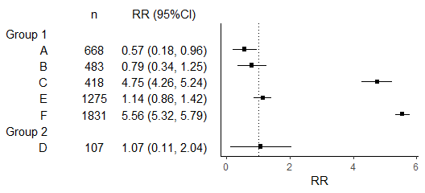
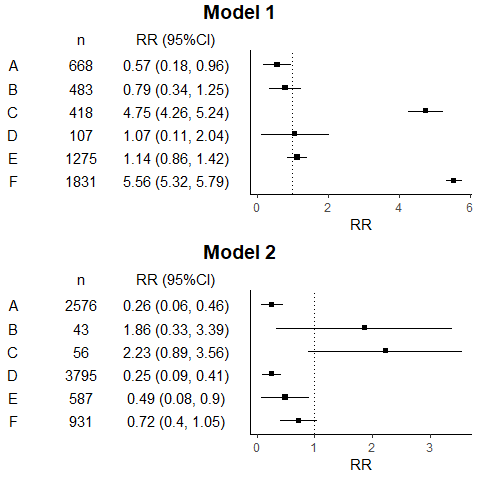
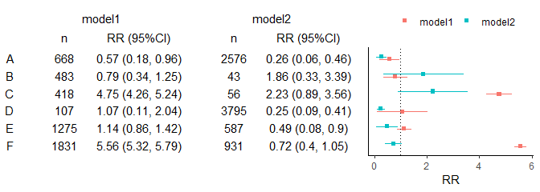

Faire un forest plot
================
Stéphane Le Vu
16/08/22

``` r
knitr::read_chunk("R/plot_effect_size.R")
```

``` r
library(ggplot2)
library(reshape2)
library(cowplot)
```

J’utilise les package `ggplot2` pour générer les figures et les
tableaux, `reshape2` pour passer d’une table en largeur à une table en
longueur (équivalent de la fonction de base `reshape`), et `cowplot`
pour combiner les objets graphiques.

Mon programme est en général fait de fonctions (équivalentes aux macros
SAS) que je peux réutiliser sans dupliquer le code.

### Figure de base

Je commence par simuler des données. La façon dont c’est fait n’a pas
d’importance. Seule la forme des données est importante. On a un table
contenant des nombres de sujets (`events`) et des estimateurs centraux
(ici risque relatif) et leur IC95% (`rr_ci`) pour des variables A, B, C,
etc. :

``` r
#' m number estimates
#' n samplesize multiplier
#' k decimal rounding
#' sep separator for CI
#' groups group labels
## debug m = 6; n = 1e3; k = 2; sep = ", "; seed = 123
make_data <- function(m = 6, n = 1e2, k = 2, 
                      sep = ", ", 
                      seed = 123){
  set.seed(seed)
  var <-  LETTERS[1:m] ## estimates labels
  rr  <-  exp( rnorm(m) ) ## sort of RR
  de <-  runif(m)*rr
  lo <-  rr - de
  up <-  rr + de
  events <- round( n / de^2 ) ## let's pretend
  rr_ci <- paste(round(rr, k), 
                 paste0("(", round(lo, k), sep, round(up, k), ")") )
  data.frame(var, events, rr, lo, up , rr_ci )
}
( d <- make_data(seed = 123) )
```

    ##   var events        rr        lo        up             rr_ci
    ## 1   A    668 0.5709374 0.1840870 0.9577879 0.57 (0.18, 0.96)
    ## 2   B    483 0.7943926 0.3394969 1.2492883 0.79 (0.34, 1.25)
    ## 3   C    418 4.7526783 4.2635104 5.2418462 4.75 (4.26, 5.24)
    ## 4   D    107 1.0730536 0.1074932 2.0386140 1.07 (0.11, 2.04)
    ## 5   E   1275 1.1380175 0.8579654 1.4180697 1.14 (0.86, 1.42)
    ## 6   F   1831 5.5570366 5.3233103 5.7907630 5.56 (5.32, 5.79)

Je trace la figure des estimations + IC95%, qui ressemble à ça :

``` r
make_plot <- function(dt = d, 
                      x = "rr", y = "var", 
                      lo = "lo", up = "up", 
                      labx = "RR",
                      co = NULL,
                      dodgew = 0){
  dt$var <- factor(dt$var, rev(unique(dt$var))) ## reverse order
  pos <- position_dodge(width = dodgew)
  p0 <- ggplot(dt, aes_string(x, y, 
                              colour = co))
  p1 <- p0 +
    geom_point(position = pos, shape = 15 ) + 
    geom_linerange(aes_string(xmin = lo, xmax = up),
                   position = pos,
                   show.legend = FALSE) + ## error bars
    geom_vline(xintercept = 1, linetype = "dotted") + ## reference
    xlab(labx) +
    theme_classic() +
    theme(
      # axis.text.x = element_text(size = 12,colour = "black"),
      axis.text.y = element_blank(), 
      axis.title.y = element_blank(),
      # axis.line.y = element_blank(),
      axis.ticks.y = element_blank(),
      legend.position = "top",
      legend.title= element_blank())
  p1
}
p0 <- make_plot()
```

``` r
p0
```

<!-- -->

Séparément, je construis un tableau pour accompagner la figure, qui lui
même est un objet graphique. Le tableau peut contenir un nombre
arbitraire de colonnes. Il ressemble à ça :

``` r
make_table <- function(dt = d, size = 11, 
                       id = "var",
                       id2 = NULL,
                       x = c('events', 'rr_ci'),
                       lbl = c("n", "RR (95%CI)")){
  dt$var <- factor(dt[, id], rev(unique(dt[, id]))) ## reverse order
  long_d <- reshape2::melt(dt[, c(id, id2, x)], id.vars = c(id, id2) )
  d0 <- ggplot(long_d, aes_string(x = "variable", y = id, label = "value")) +
    geom_text() +
    scale_x_discrete(position = "top", labels = lbl) +
    theme(panel.background = element_blank(),
          axis.text.y = element_text(size = size, colour = "black"), # element_blank(), 
          axis.text.x = element_text(size = size, colour = "black"),
          axis.title = element_blank(),
          # axis.line.y = element_blank(),
          axis.ticks = element_blank())
  if (is.null(id2)) return(d0) else {
    d0 +
    facet_wrap(id2) +
      theme(panel.background = element_blank(),
            strip.placement = "outside",
            strip.background = element_blank(),
            strip.text = element_text(size = size, colour = "black"))
  }
}
d0 <- make_table()
```

``` r
d0
```

<!-- -->

Et je combine les deux dans une même figure.

``` r
plot1 <- cowplot::plot_grid(d0, p0, align = "h", rel_widths = c(1, 1))
```

``` r
plot1
```

<!-- -->

### Exemple avec groupes de “variables”

Pour regrouper les variables sous un label, je reformate la table de
départ. Encore une fois la manipulation n’est pas importante, il faut
juste comprendre la forme de la nouvelle table. Seule la colonne `var` a
été modifiée par les nouvelles lignes, le reste est manquant.

``` r
groups = c("Group 1", "Group 2")
d1 <- d
d1$group <- sample(groups, nrow(d1), replace = TRUE)
## might be simpler wih tidyverse
{
  a <- by(d1, d1$group, identity)
  aa <- unlist( lapply(a, function(x) list(NA, x)) , recursive = FALSE)
  d2 <- do.call(rbind, aa )
  d2[ which(is.na(d2$var)), "var"] <- names(a) ## fiddly
  rownames(d2) <- NULL
}
plot2 <- cowplot::plot_grid(make_table(d2), 
                            make_plot(d2),
                            align = "h", rel_widths = c(1, 1))
```

``` r
d2
```

    ##       var events        rr        lo        up             rr_ci   group
    ## 1 Group 1     NA        NA        NA        NA              <NA>    <NA>
    ## 2       A    668 0.5709374 0.1840870 0.9577879 0.57 (0.18, 0.96) Group 1
    ## 3       B    483 0.7943926 0.3394969 1.2492883 0.79 (0.34, 1.25) Group 1
    ## 4       C    418 4.7526783 4.2635104 5.2418462 4.75 (4.26, 5.24) Group 1
    ## 5       E   1275 1.1380175 0.8579654 1.4180697 1.14 (0.86, 1.42) Group 1
    ## 6       F   1831 5.5570366 5.3233103 5.7907630 5.56 (5.32, 5.79) Group 1
    ## 7 Group 2     NA        NA        NA        NA              <NA>    <NA>
    ## 8       D    107 1.0730536 0.1074932 2.0386140 1.07 (0.11, 2.04) Group 2

`ggplot` ignore les données manquantes et j’obtiens ça :

``` r
plot2
```

<!-- -->

### Exemple pour deux “modèles”

Je commence par générer une deuxième figure basique, puis je la combine
avec la première en ajoutant des titres.

``` r
d3 <- make_data(seed = 456)
plot3 <- cowplot::plot_grid(make_table(d3), make_plot(d3),
                            align = "h", rel_widths = c(1, 1))

#' Add title to a cowplot object
#'
#' @param p the cowplot object
#' @param title title
#' @param rel_heights relative heights between the title and the cowplot object
#'
#' @return the plot with title added in
#' @export
cowplot_title <- function(p, title, rel_heights = c(0.1, 1)) {
  title <- cowplot::ggdraw() +
    cowplot::draw_label(title, fontface = "bold")
  cowplot::plot_grid(title, p, ncol =1 , rel_heights = rel_heights)
}

plot4 <- cowplot::plot_grid(cowplot_title(plot1, "Model 1"),
                              cowplot_title(plot3, "Model 2"), 
                              ncol = 1)
```

``` r
plot4
```

<!-- -->

### Exemple pour deux “modèles” en ligne

``` r
d5 <- rbind(cbind(d, model = "model1"), cbind(d3, model = "model2") )

t5 <- make_table(d5, id2 = "model")

p5 <- make_plot(d5, dodgew = 0.3, co = "model")

plot5 <- cowplot::plot_grid(t5, 
                   p5,
                   align = "h", axis = "bt",
                   rel_widths = c(1, .5))
```

Les résultats des deux modèles sont réunis avec une variable `model` les
différenciant.

``` r
d5
```

    ##    var events        rr         lo        up             rr_ci  model
    ## 1    A    668 0.5709374 0.18408699 0.9577879 0.57 (0.18, 0.96) model1
    ## 2    B    483 0.7943926 0.33949686 1.2492883 0.79 (0.34, 1.25) model1
    ## 3    C    418 4.7526783 4.26351040 5.2418462 4.75 (4.26, 5.24) model1
    ## 4    D    107 1.0730536 0.10749317 2.0386140 1.07 (0.11, 2.04) model1
    ## 5    E   1275 1.1380175 0.85796537 1.4180697 1.14 (0.86, 1.42) model1
    ## 6    F   1831 5.5570366 5.32331027 5.7907630 5.56 (5.32, 5.79) model1
    ## 7    A   2576 0.2609252 0.06389927 0.4579512 0.26 (0.06, 0.46) model2
    ## 8    B     43 1.8622316 0.33207115 3.3923921 1.86 (0.33, 3.39) model2
    ## 9    C     56 2.2274884 0.89340513 3.5615716 2.23 (0.89, 3.56) model2
    ## 10   D   3795 0.2493513 0.08701525 0.4116874 0.25 (0.09, 0.41) model2
    ## 11   E    587 0.4895068 0.07679518 0.9022185  0.49 (0.08, 0.9) model2
    ## 12   F    931 0.7232061 0.39542150 1.0509907  0.72 (0.4, 1.05) model2

La table est générée en présentant deux panels et la figure en traçant
deux estimations par lignes, selon la variable `model`.

``` r
plot5
```

<!-- -->
